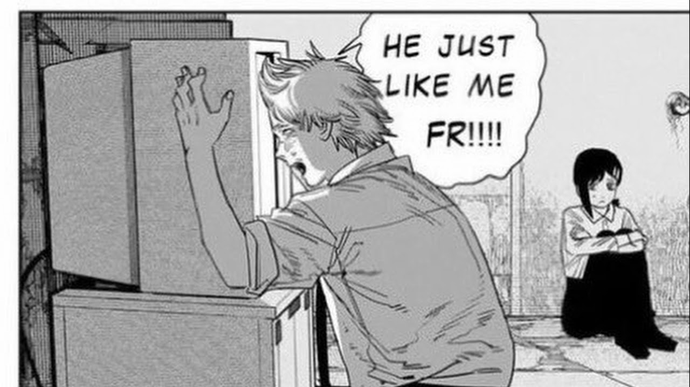
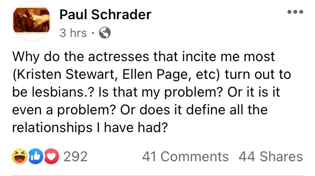
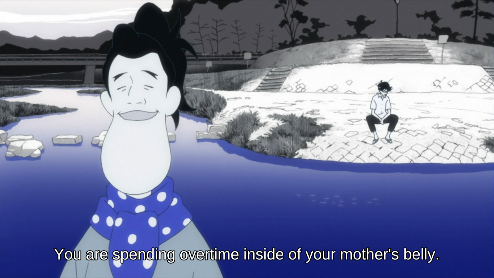
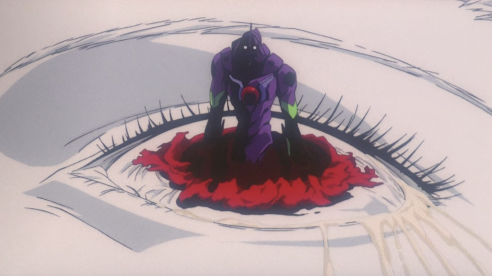
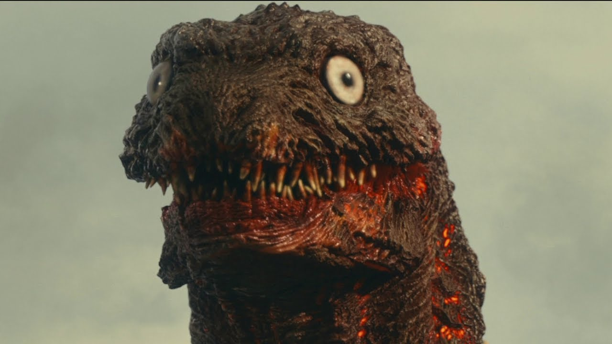
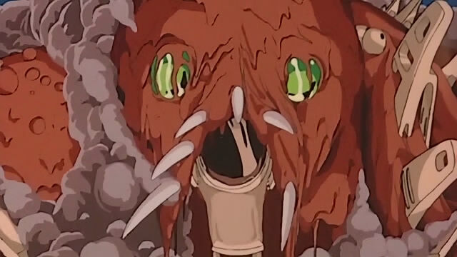

# evangelion thoughts

## zhol
## April 11, 2022

this contains spoilers for some childrens cartoons, i'm sure you can handle it. it's also unfinished but it's grown too long for me to give a proper ending for, or fit in all the things I wanted to talk about originally

## prologue

I'm going to talk to you about *Neon Genesis Evangelion*.

*Mob Psycho 100* is a cool show for young adults that doesn't do any obnoxious heady meta-analysis about the state of anime and its viewership - most of the time. Most of the time, you get to see psychic children who have some major emotional damage, to the point where you feel that part of their soul, or the part of the brain that helps you relate to the feelings of other people, has gone missing. As guaranteed by the Japanese Constitution, they use their powers to bash the ever-loving shit out of each other, and as the season runs on, the stakes, as well as their abilities to kill each other, grow ever larger, ever more capable. But, something genuinely special occurs at the close of the first season:

>! The tension that explodes before the denounment of the season is quantified in an extremely literal sense, in that Mob, the titular character of the show, has some gauge visible to the viewer scaled 0-100, where 0 represents total emotional peace, and 100 implies a cataclysmic psychic breakdown where his unleashed power matches that of a nuclear warhead. As the series runs, and Mob is put into more stressful situations (him being attacked, his friends being attacked, his brother being attacked, his brother attacking him), the meter ticks up. The final episode of season 1 reaches this explosion of tension, as the lives of those he loves the most are put immediately on the line, as well as some general threat of world domination or something. The stakes don't matter: what does matter is that the viewer is fully expecting this to end with an explosion of violence. Maybe the viewer is dreading that people are going to get hurt, but more realistically, they're rooting for it - they're cheering on the emotionally stunted teenagers to turn villains, who probably had people who love them too, rich inner lives, into a blasted wet paste fit only to be fed to a dog. As the fuse is about to be lit, instead, Mob's psychic energy gets transferred to his bumbling, incompetent, shyster mentor who has been making money off of Mob's psychic capabilities all season long, Reigen. Reigen is not aware of this happening at all. As villains lay down psychic blasts that could kill dozens, if not hundreds, an empowered Reigen bats away their attacks, brushing them off as dazzing special effects that don't do much - he presumes they're just playing a prank on him, one with high quality CGI. All the while, he's admonishing them for being jerks, and tells them: grow up! Get a job! Go back home! Whatever weird cult thing you're doing here is stupid, get real, dude. No one gets hurt (that bad), no one dies, and the villains take Reigen's advice to heart, and go legit. They become florists, or street crossing guards or something. They probably call their parents on weekends to ask how they're doing, and take pottery classes at the local community college, maybe they see a therapist from time to time. To the viewer who was rooting for the aformentioned human-to-paste conversion to occur, they have been brought to the edge of nutting by the prom queen, who then swiftly ties their hands behind their back and hops into a cab waiting outside. But for the rest of us, this is a solid rug-pull into an unexpected, sweet and happy. If you're a reasonable person, this is maybe the happiest ending you could've hoped for.

What am I trying to say here? If you're not satisfied with how that ending played out, fuck you.

When I want to come up with an example of a show that understands its viewers, and understands that a substantial portion of them have expectations that should not be catered to or satisfied, I think of *Mob Psycho*. I bring it up just to provide an example of what *Eva* does kind of a good job at, but isn't necessarily polished about it. It's had to take multiple stabs at it to get the job done, in the same way that it took multiple people to cut the head off Yukio Mishima. The first draft doesn't always take, you have to adjust the structure, the ending, the blade.

I don't think this is pointlessly hostile - I think it's intriguing for the series to show how easily you can be read. It's tickling you as it explains where each of your sensitive areas are. Sometimes this is unintentional. Sometimes it is intentional. But this is where *Eva* is great - denying the viewer short-term gratification as an opportunity to expose what their worse instincts are. There's a difference between writing a shit plot that pisses everyone off, and writing a plot that understands viewers expectations so it knows where to undermine them, and *Eva* does the latter much more often than the former.

## introduction

To save the reader a lot of time, here's the central thesis:

> Q: Is it okay to fuck over your viewers?

> A: If they deserve it, yes.

Are you still here? Thanks, feel free to keep going.

In the great history of people who entered the keyboards hobby and ended up buying some of those cool looking Japanese sublegend sets with their funky little letters and all, I don't think I've watched that much anime. Not that I'm not familar - I am. I've got fond childhood memories of some low-power TV station suddenly getting a 1.5 hour after-school Funimation block. This would've been in about 2006 or so, and the offerings were slim; I'd get one episode of Detective Conan, one episode of Galaxy Railways, and I do not remember watching any Kiddy Grade for the life of me, even some that article implied it was part of the block. Two shows constitute the breadth of slightly exotic anime I'd be exposed to over the TV as a kid, barring watching Pokemon and Yu-Gi-Oh on Foxbox. What I did have access to was the public library; instead of being able to watch whatever Toonami/Adult Swim had to offer, I could go through out-of-order volumes of Dragon Ball, Ranma 1/2, Hunter x Hunter, Naruto, and so on. (I'd also squirrel away a volume of Rizelmine, read through it in the most private corner of the library I could find, and never check it out.) In time, I started to supplement this by downloading stuff off the internet - at this point, we had upgraded the family computer to one with Wi-Fi, and our neighbors had an unsecured network capable of 330KBps download, which is just enough to watch The Legend of Black Heaven uploaded to YouTube at 240p. Later, I'd find scanlations of the latest Naruto: Shippuden chapters uploaded on 4chan, as well as Rapidshare/Megaupload links to wherever the anime had caught up. (It didn't take me long to get tired of dealing with boring filler shit.)

Eventually, I'd stumble on Evangelion, not that I can recall how I ended up finding or downloading it. Infrequent references scattered across the parts of the internet I browsed probably had me search the thing up on Wikipedia, read a general synopsis for a few minutes, and close the tab afterwards after getting bored. As for how I got around to accessing the thing, here is the only logical explanation for what had transpired:

1. After reading enough pages of *Pictures for Sad Children*, I end up believing that depression is something shared among the very cool.
2. By the benefit of divine providence, reaching this emotional milestone triggers the release of cosmic radiation aimed at the hard drive of the laptop shared between my brother and I, and manages to flip a few billion bits.
3. A folder filled with 480p resolution episodes of *Neon Genesis Evangelion* appears in my downloads folder.

It's not that it's unexpected for me to watch it; if anything, it's on-brand. If you saw what I looked like in high school, and you had a conversation with me about what I was learning in Japanese, then you'd be able to read teenage Zhol like a book. It's overwrought, instinctually self-reflexive, simultaneously extremely self-aware while obnoxiously lacking self-awareness elsewhere, and invested with the aesthetics of philosophy and post-modernism - as some dweeb doing policy debate who could give you the worst explanation of Baudrillard you'd ever heard, this would be my shit! Regardless, I pressed play.

Pictured: the Author as a child, having made it halfway through *Evangelion*.

## what did you see?

Shinji Ikari, the main character of *Evangelion*, is a 14-year old child who has trouble navigating the world, interacting with people, performing basic tasks, and has worrying relationships with the women in his life. When I was watching this for the first time, I was a 14-year old child who had trouble navigating the world around him, never knew how to present themself, and didn't know how to talk to girls. Truly, what a relatable show. This is marketing-as-writing, this is understanding that if you have a TV show that you're going to market to teenagers, a cheap and reliable way to keep them interested is to make the protagonist their age; this tends to work well for most age groups, barring grown ass adults who are over-invested in YA fiction, but I digress. As a 14-year old, I thought it was so cool that Shinji was depressed, and that he had hot women in his life, and it flattered my intellectual sensibilities; it brushes with introductory concepts of psychoanalysis, philosophy, postmodernism, with the same comprehension that I had, which is to say it presents not much more than a passing interest in the aesthetics of discussing philosophy itself more than comprehensive comprehension. I never developed a deep understanding for Freud, Lacan, or Nietzsche, but I knew it was cool to understand them, so I postured as someone who understood these theorists and their other miscellaneous contemporaries. Evangelion is guilty of buying into aesthetics over substance when it comes to the headier subjects it touches on, be they the philosophical influences, or its eschatological concerns importing esoteric Judeo-Christian imagery without any Christian ethic or story-telling instincts; again, relatable to me. I blew through the episodes over the course of a few nights, and on making it to the end of Episode 26, I texted one of my brothers friends who was also enthusiastic about *Eva* to report I had made my way through successfully. Thus began a cycle of annoying self-reflexiveness and hyper-self-awareness masking other levels of lack of awareness on my part that plagues me to this day still. I'm still working through it, and I'm less annoying than I was as a 14 year old.

I didn't obsessively re-watch *Eva* afterwards, and I probably got back to whatever it was that I was doing in high school, some combination of high school debate, loitering at local Walgreens's, and light arson. I think at some point I watched the third *Rebuild of Evangelion* movie at the local theater because I wanted to go see it with someone from my Japanese class who I thought was cute (due to misc. incompetence, I didn't end up sitting next to that someone). The second time I watched it all the way through was probably during my freshman year of college; I was taking an introductory ethics course that was required by my major, which I would soon abandon, but at that time, we were given some reading material that re-explained Nietzsche in simpler terms instead of just reading Nietzsche - glory to the post-secondary education system for showing how much faith in us it had. But through that second watch-through, I was less concerned with enjoying the aesthetics of philosophy and depression, and more interested in a vaguely Nietzschean reading of *Eva*; specifically, the *will to power* as it relates to Shinji, and something on how suffering provides context to life to make life worth living. That second part could probably have much to do with the way *End of Evangelion* plays out, ending with Shinji choosing a mortal life of suffering over a perfect immanent eternal life. Maybe it had something to do with my struggle to find reasons to make life worth living - when I expressed to a friend later that summer how I was feeling, he suggested that it sounded like I was depressed and had yet to realize it. Maybe it had something to do with [my own philosophy TA](https://www.dukeupress.edu/sexual-hegemony) passing that spring. Maybe it was the universe working to prepare me for when I considered ending it all a the following summer. But I found that *Eva* was like revisiting old Simpsons episodes I watched first when I was 9 - every time I revisit it, I get to take away something back a bit different over the last time.

The third time I watched through *Eva*, it was in the company of my partner, who I had started dating. I'm not sure what it was that I was experiencing at the time, but I think I gained some reading of the oedipal side of *Eva*, one that I'm not too interested in discussing currently. I don't think I've watched it since. I just sit and think about it. I guess this should be a testimony of how pregnant the writing is with possibilities, and it's cool that repeated re-watchings are able to have their own importance (more than re-watching the same fight scene with diminishing returns), but I digress from a second digression I need to make later.

## the mirror stares back at me

This is another detour, but it is also vital that I explain this to make sense to contextualize the next thing.

I'm not going to go through the chore of summarizing who Yukio Mishima is. If you know, you know his story, and if you don't, you don't require much context for me to explain my next part. All I need to say is that he is capable of world-class levels of misogyny in his writing only accessible to homosexual men who have moved beyond any need for women in their life, and that he staged a ultranationalist paramilitary coup against the Japanese government to restore the power of the emperor, and that this coup attempt was maybe in part invoked by his own eating the aesthetics of fascism because of how god damn sexy they are, and maybe in part a extremely convoluted front to commit ritual suicide (oh, forgot to mention, he committed suicide after the coup failed) before his aging body could fail him any more. After he failed to completely disembowel himself, he brought in his second-in-command to behead him to end his life easier. When his second-in-command failed to behead him after three attempts, his third-in-command had to be called in to finish the job. It's funny, in a grim way.

We all eat out of the trash can of ideology.

Now that that's out of the way, I can get to explaining a more important point.

A couple years ago, right when pandemic was starting to set in that we were in for the long haul, I got around to watching a video about this Mishima fella that maybe a couple of my more book-reading friends (I'm talking about you, Jackie). It's *Mishima: A Life in Four Chapters*, dir. Paul Schrader.

Pictured: Paul Schrader is much easier to explain (justify) to my friends than Mishima would ever be.

I like the film enough: its aesthetics are dreamy, perfect for how I imagine books in the theater of my mind. It's acted well, directed and cut competently, and so on. That's not what's important, unless you were looking for a reason to watch it, in which case, yes, it's a good looking movie, and you should watch it. Here's the important part: *Mishima* juxtaposes adaptations of his writing against a depiction of his life at the time where he was writing it. Where Mishima felt weak, he wrote about weakness. Where he was exploring a confused and fucked up sexuality, he wrote about those exploring their confused and fucked up sexualities. And when he was on the verge of organizing a paramilitary group to stage an ultranationalist coup against the government, you would better believe he was doing the same thing in real life. I'm not implying that when J.K. Rowling wrote *Harry Potter* that she was parenting a child wizard, but the film expresses a clear and convincing argument that for competent creative works, the author is reflected in that work. Schrader establishes the parallels so effortlessly that it would seem obvious to anyone who knew Mishima that he was planning on handing the JSDF to the Emperor, and would commit suicide in the saddest, funniest way possible. Hindsight is 20/20.

Now when I look at *Eva*, I don't see a structured, uniform work. This was not made by someone who came into the studio with a complete plan. I see a work that was evolving while it was being produced and broadcasted, one with a head whose sources of inspiration flipped as frequently as his mood, as with his capabilities, as with his studio's funding. When you write, when I write, when we write, we never keep the first draft, we revise, we re-read, we re-structure, we discard, and we re-develop whatever it is that we wanted to write in the first place. Writing is a mercurial activity, and Anno developed *Eva* in a mercurial style. This is not to say that *Eva* is completely Anno's work, and it's not to credit all of it's writing changes to him; there's a team behind him, and there's a context for why certain things on the show happen that are outside his control. I'd like to believe I'm smart enough to take this to heart, but I still see *Eva* as a work largely pioneered by him. When I look at *Eva*, I don't see a work trying to tell a story, or tell me *something* about life (although it does these things servicably enough), I see a creative "going through it". I think it's cool to see Anno grow as a person across the course of the show, and his change in personality and interests does well to keep the show fresh.

As you see the beginning of the show, you can see the director, ready to operate at full capacity, beginning his master class mecha show, with all the base features of mecha anime - teenage pilots, inhuman enemies, globally terminal stakes, and virtually impossible odds. For a large portion of the 26 episode run, the show operates fairly conventionally; it's a bit of monster-of-the-week, with the occasional reprieve where Shinji gets too sad, runs away, and needs to be corraled back. It's got annoying recap episodes, like other conventional *shonen* anime. There are other cultural references that were lost on me initially that I've needed explained - Anno also invokes his love of *kaiju* movies, and Super Sentai stuff like *Ultraman*. Other influences you start to see pop up as Anno finds inspiration over the course of its production; I see the director Anno looking through books about religion when the esoteric religious imagery appears. When it dips philosophical, I can see him flipping through Kierkegaard and Nietzsche, Freud or Lacan, maybe even Derrida. I can see him in the library, reading about new world order conspiracy theories as the SEELE's presence becomes more apparent. And where Anno becomes depressed, I can feel that depression bleed through the writing.

Where you can see the *Eva*'s material context appear, outside of Anno's state, is in the last two episodes.

## the bitter end, pt. 1: making more with less 

The infamous story for why Episode 25 and 26 are they way that they are is that the animation budget ran out at that point in the show's production, but they still had two more episodes of plot to give. So, with all the scraps and sketches of dialogue and animation from past scenes, the team begins to form a collage of anime, a parody of itself, one last unintentional self-referential statement piece, that *Eva* is *Eva* is *Eva* is *Eva*. It can also be more frustrating to watch than all the episodes where Shinji runs away from NERV, more confusing than all the shit about what *instrumentality* is supposed to be, or what SEELE is up to, or what Gendo's up to, or what the fuck happened to Shinji's mom, and so on. Here is what you see: the Human Instrumentality Project is complete. Every soul has been liquified and poured into the Kool-Aid Man collective consciousness, where everyone has merged into everyone, and everyone completes everyone else. This isn't in a physical space, it's in the soul soup of limitless imagination, it's pure thought, it's pure ideology! Ambitious or simply victims of circumstance, it's impressive how well it works - they had absolutely nothing by which they needed to represent an unrepresentable place. Even a partial success at an impossible task is something to remark on, and moreover, it treats the viewer with dignity other shows don't afford; *you're a grown up, you can figure this one out, you just have to meet us halfway here.*

I think given their requirements, it's hard to imagine the series ending any other way: in an ambitious mess that either shoves its head so far up its own ass it can't see where to move next, or failing to clean up its own mess (more the latter). Now, *Eva* is not much of a plot-driven tale: while there is some plot, the viewer isn't given an explicit marker of progress beyond the sense that there are a limited number of massive aliens to defeat, and eventually they will run out, at which point something else vague and ill-defined will happen. (Compare this to how *Mob Psycho* gives you a literal number to show how close you are to the climax) The vagueness and lack of definition is something I'm not interested in defending, and could be read as good or lazy mystery writing, with all takes valid. There are serviceable action scenes, but there's not much to consume, unless you're very patient. If you're using every part of the metaphorical cow, you're feasting on the characters - you see how they grow, regress, treat each other, and you feast in the revelations of their background. There are three things happening here: they're explaining the struggles of the characters as literally as possible, they're trying to provide closure for as many people as possible with their time constraints (this is only partially successful, as we only get to see the inside of Shinji's soul during Episode 26), and they're trying to do this while representing a space that is unrepresentable. On one level, holy fuck this is confusing to watch for the first time and not have a co-pilot there to guide you into this, but on another, it's giving you closure. This is a very charitable moment in *Eva*; it's not hostile, it's not alienating, it's trying it's best to give a somewhat satisfying conclusion after it fucked itself throwing around a bunch of mysteries it was kinda struggling to solve on its own. The apologist in me recognizes that it collapses under the weight of its own ambitions and the task it gave itself, the friend I am to others has watched the confusion develop on my friends' faces as they go through 25 and 26 and need their hand held, and I admit that it's necessary to hold their hand and provide explanations. I still believe that any other team would have done a much worse job trying to clear things out. (This is also how I feel about how *3.0+1.0* optimally misses the mark on providing a perfect ending, but that's a different discussion)

## the bitter end, pt. 2: going goblin mode

If your fans are sending you death threats after you end your mecha anime with a zero-budget collage, I think it's fair, if not kickass, to treat them with hostility and contempt. It's in line with the show's criticism of using fantasy media and miscellaneous nerd hobby shit as a method of escapism, it's in line with Anno's contempt for himself for doing the same thing, and it's in line with a sense of justice I keep in my heart. I'm not saying that fans have no right or stakeholdership in some franchise, barring all the parasocial implications and case studies of fans being shitty and weird about things they're fans of (*The Snyder Cut*, *Star Wars* after the original series, 90% of whatever you can read on *AO3*, stan culture, etc). Fans taking ownership of some franchise can be of great benefit to the community that enjoys *something*, from fanart, unofficial translations of *stuff*, and fan-organized conventions. Being a member of some harmless fun community is a great thing! I don't think the motivation for *End of Eva* being created was much to do with requesting a more satisfying ending that overcomes the budget limitations that affected Episodes 25 and 26, but entitlement of fans to decide how a story goes, and receive a satisfying conclusion that ignores *Eva*'s kneejerk instincts to frustrate the viewer pleading for anything specific to happen. You're here for the ride, motherfucker, and there's no refunds. You were cheering for some teenagers to break their brains throwing themselves into some fucked up bio-mecha mother that barely works and will probably kill them! Who gives a shit about what you want!

With that said, I believe Anno is left with the righteous task of figuring out the brains of the worst people alive who demanded for this movie to be made, analyze what they're looking for, and use that knowledge to make some good points. *End of Eva* has a two-part mission: 

1. End the story after Episode 24 in a fairly literal way. 
2. Send a great big "fuck you" to all the people who made Anno make this.

Done. There's no happy ending. It's uncomfortable from the moment the movie begins, it's uncomfortable when Misato kisses Shinji, it's uncomfortable when Misato dies, and right when you think it's going to come to a glorious victory for NERV with the arrival of a reinvigorated Asuka who can guide us to a happy ending, you get kicked in the back of your knees by watching her Evangelion get gang-raped the moment her juice runs out. At the end, almost everybody on the god-damned planet is in some indeterminate state of un-death, barring Shinji and Asuka, who are left stranded on a fucked-to-death beach surrounded by surreal apocalyptic imagery. The only thing that can assure Shinji that he's alive is by choking the only other person there, the Other, Asuka. Good night everybody!

Simultaneously, it's impossible to claim that the movie was phoned in. Maybe it's baffling, maybe it's confusing and even more frustrating, but it's focused and deliberate in every step it takes. You want fight scenes? The whole first act of the movie is fighting, when it's not rushing to establish the next sequence of fight, and even during that downtime, there's something *important* happening, something *relevant*, something *fucked*. It's as spectacular as the medium was capable of at the time. There's no min-maxing of the budget to pace the anime as slow as possible in order to make the fight scenes worth it. It's bloody, gruesome, visceral, and the choreography is top of the line stuff, really. For someone who doesn't give a shit about *Eva* much, they're going to be memorable; for someone who does care, the bloodied mechas, the crucifixion, the surreal body horror all feel iconic. It still remains committed to itself and the spirit of the original ending, with the third act treating the viewer to that immaterial psychic space where we view the characters' psyches blasting against each other, but meandering about less and exposing contradictions more. Across a tidy 87 minutes, moments aren't wasted on their way to the destination.

Pictured: Holy shit, dude.

You start to realize that while Episode 25 and 26 was maybe the happy ending, and you have traded a mysterious happiness for unambiguous pain; do you realize this when Asuka gets psychically stabbed through her entire face? Is it when Shinji sees Rei's rotting face twisted out of the flesh of a Mass-Production Evangelion? Is it when Rei commits planetary annihilation of the human race? Taking an explicit straightforward ending highway takes us straight to discomfortville, where we're left to contend with a few questions that I'm too lazy to dig into further - what does this say about Shinji dealing with his own depression? By choosing living on Earth, has he grown as a person? Would you reject Instrumentality? Do you think that the pain of living accentuates pleasurable moments?
All I can say is that the end shows Shinji deciding to live a life outside Instrumentality, where he accepts the barriers and boundaries between him and other people, while 25 and 26 imply accepting Instrumentality to fill in the gaps in his own person. This is the fundamental distinction between 25 and 26 and *End of Eva*, and that's the big takeaway for what I think the viewer should consider Instrumentality as being. Even when forced to show his work and take some of the mystery out, you're still left with some aftertaste that'll roll around in the tongue of your mind for a while; I'm still talking about it here.

### explo[d/r]ing evangelion (part 3) - 3.0: I'll give you what you fucking want

If you are familiar with the *Rebirth of Evangelion* series, then you can skip this paragraph. If not, let me be brief: *Rebirth of Evangelion* is an *Evangelion* reboot that acquires the original series base-level plot, setting, and characters, but leaves most of its jadedness and reflexivity in the past. It's missing details that require you to pay attention for you to notice (background radio/TV dialogue being a stand-in for characters fights, reuse of choreography to connect disjoint scenes, frequent oedipal overtones). Instead, it's straightforward, it's not mysterious, and it's streamlined for film - you're in a cycle of plot dump, action sequence, plot dump, action sequence that lasted between 2007's *Rebirth 1.0* and 2021's *Rebirth 3.0+1.0*. Big robot fight big alien, gratuitous shot of teenage girl chest, leg, and/or rear, and your brain no have work hard to see cool robot punch god.

There's one exception to this, and it's what elevates the third *Rebirth* movie from "the one that goes off the rails" to something a bit more special. Here is what some of the worse viewers of Evangelion see from Shinji:

1. There's a great crisis.
2. Shinji doesn't get in the robot, as he does not want to.
3. The viewer is cucked, and the crises worsens. Fuck you, boy blunder.

This is what they want and expect:

1. There is a great crisis.
2. Shinji, having grown a pair, enters the robot.
3. Shinji solves the problem via the robot's capabilities for tremendous violence. Later, he will bed whoever you believe Best Girl to be, or Kaworu.

This is what happens in Rebuild 3.0.

1. There is a great crisis, and Shinji is told he is not to get into the robot, as he will make the crisis worse.
2. Shinji gets in the robot, confident he can use this robot to solve problems.
3. Shinji instead triggers an apocalyptic event.

In conclusion, antagonizing viewers worse expectations always makes a more interesting plot.

Ok, this is a tremendous under-explanation of *Rebuild 3.0*,

## one last final

How did I get here? I'm not super sure anymore. I wanted to prove a point to one of my friends about how *Eva* doesn't suck, and it's actually good, and got very lost along the way in trying to cover the ass of some anime that was pretty cool in some parts and hasn't aged well in other parts. But here, I can remember where I started, and where I wanted to go.

> Q: Is it okay to fuck over your viewers?

> A: If they deserve it, yes.

Welcome home.

### Where does *Eva* work?

*Evangelion* is the premier example of denying the viewers what they want when they want it too much. On the other hand, due to the whole timey-wimey everything-is-canon multiverse used to expand the story like self-inflating insulation foam, it also provides a pretty satisfying battery of options for how you end.

If you want everyone to have a happy ending, where the deficits in every soul are complemented by others, you have Episode 25 and 26, where you get to see each character explore their own issues and come to terms with who they are as people.

If you wanted a violent and action-packed ending that 25 and 26 could not provide, you have *End of Evangelion*. If you wanted a straightforward explanation of what happens after episode 24 instead of pure consciousness floating around the mysterious immanent space that 25 and 26 takes place in, you have *End of Evangelion*.

If the original *Evangelion* run was too heady and navel-gazing, you have the entire *Rebuild* series to enjoy, which doesn't come bearing its postmodern aesthetics, its eschatology, its unexplained mysteries. It leans into the big monster fight sequences, gives more fan-service, adds a DLC waifu, and thirty minutes of 3.0+1.0 is spent explaining every mystery and mysterious character's motivations like a Fandom wiki plot summary. It's almost too easy. But also, it's nice to see because it shows that Anno and the team are in a much less distressed state of mind. Instead of re-treading dialogues on depression, it's got a fat budget to blow on 3DCG done right, blasting past limitations prevented them from showing more cool action shit on TV - it's a reminder that Anno doesn't want to do heady stuff all the time, if at all anymore. He's working on the new *Kamen Rider* and *Ultraman* movies, things he probably loved as a kid, and you can see that love get imported into *Eva*'s action sequences. He did *Shin Godzilla* (2016), one of my own personal favorites for combining a bureaucratic drama with a real freaky dead-eyed version of Godzilla. Its emphasized blind idiot god operations laid the groundwork for *Eva*'s angels *modus operandi*, who themselves had no brains, dead eyes, and two goals: get underground and fuck up anything that gets in its way. I've gotten distracted.

Pictured: Look at this lad.

Pictured: Really, the dead-eyed brainless monster is Anno's bread and butter.

### sometimes you gotta spank the baby when it wants it bottle and cant have it

If you enjoy the ride *Eva* will take you to every end you could have expected. If you try to tell this wild stallion where to head, it'll probably buck you off and kick you in mid-air; this is a show written by and made by annoyingly self-aware nerds, but those nerds are slightly better than the ones that go "ha ha anime bad isn't it shameful ha ha ha now I will continue to enjoy it without reflecting on my own behaviors".

If you wanted a normal ending where everyone grows up and nothing bad or confusing happens to anyone because real life shouldn't be confusing, fuck you, you get 25 and 26.

If 25 and 26 were too confusing, and not enough robots, fuck you, you get *End of Evangelion*. Everyone dies (sort of), and no one gets a straightforward happy ending.

If you're tired of Shinji not getting in the god dammed robot after 20 something years, you have the third *Rebuild* movie which has Shinji excited to enter the robot once again, which, spoiler alert,
>! shows Shinji deciding that he can solve problems by embracing getting in the robot, which nearly triggers the apocalypse *yet again*, and leaves him practically responsible for the death of Kaworu. This is a step up from the anime run, where 

If you were super invested in the navel-gazing parts of *Eva* that were so sure of how smart of an anime it was, and how you're smart for enjoying difficult media like *Eva* (you also like to tell your dates that you listen to Gerogerigegege and try to have sex to the sound of Death Grips), *Rebuild* won't flatter your big folded wrinkled brain. It's popcorn theater. Grow up dude, just be normal for once in your life.

In conclusion, people who watch anime should watch other things too.

zhol
